# Intro to SQL

Download the free e-book, [Learn SQL](https://cdn2.hubspot.net/hubfs/392937/Learn%20SQL.pdf), which is an excellent introduction to SQL and relational databases.

### Practice running common SQL commands using the following SQL Bolt tutorials.
- Lessons 1 through 6 - SQL Queries
    - 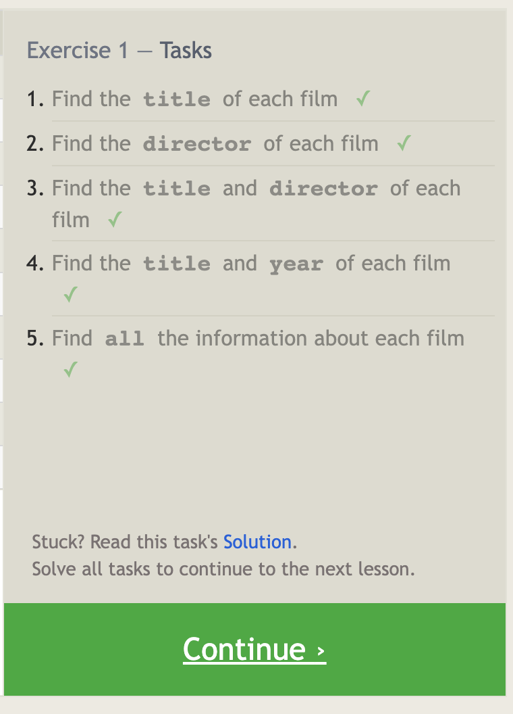
    - 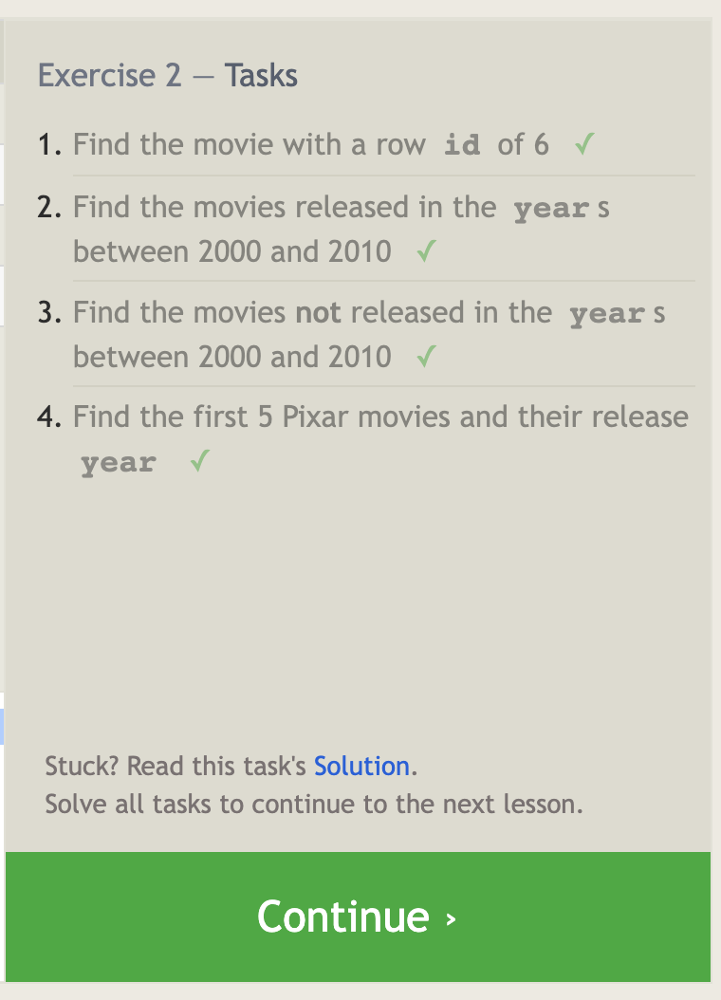
    - 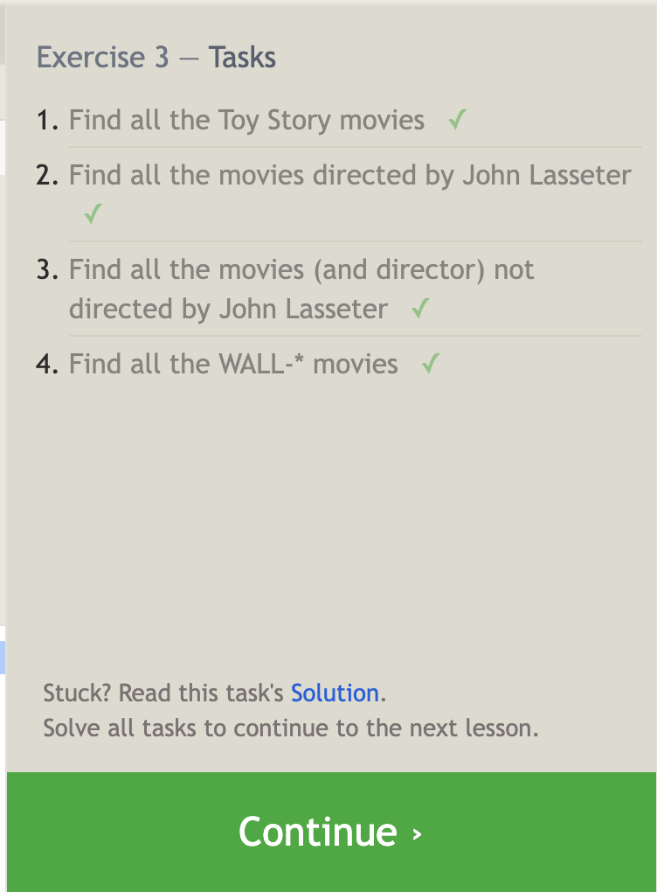
    - 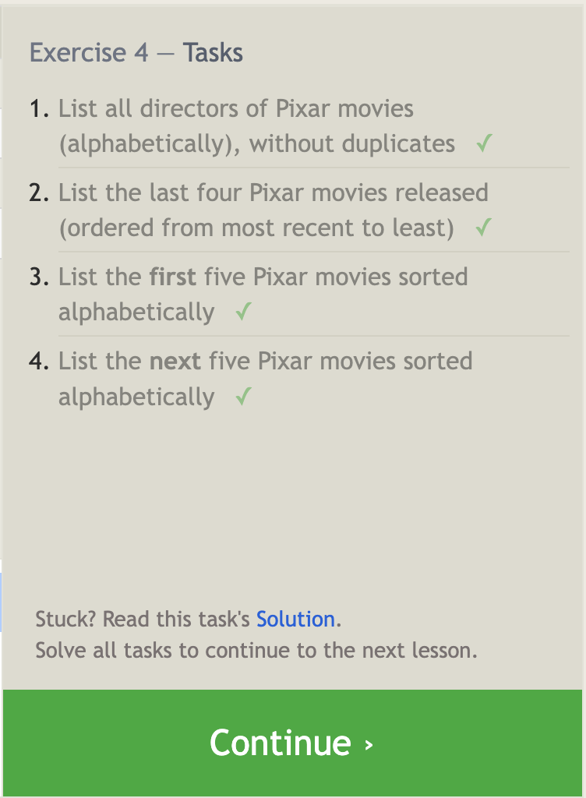
    - 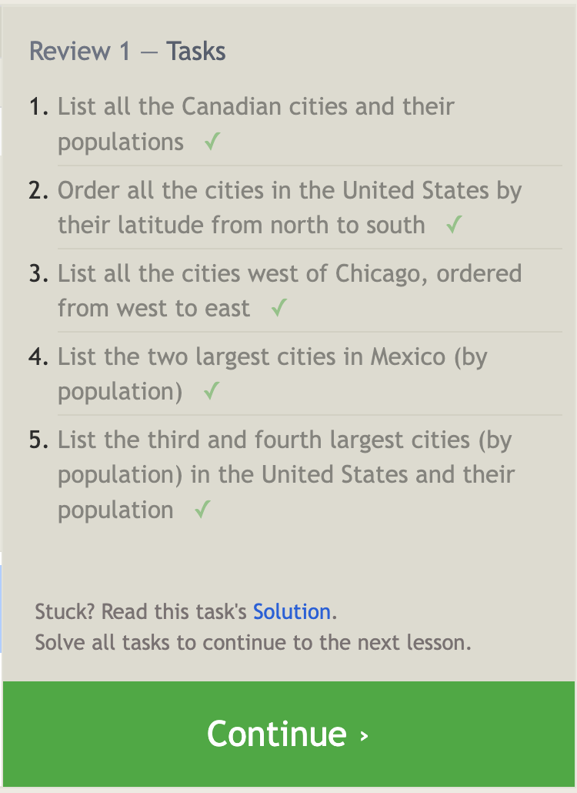
    - 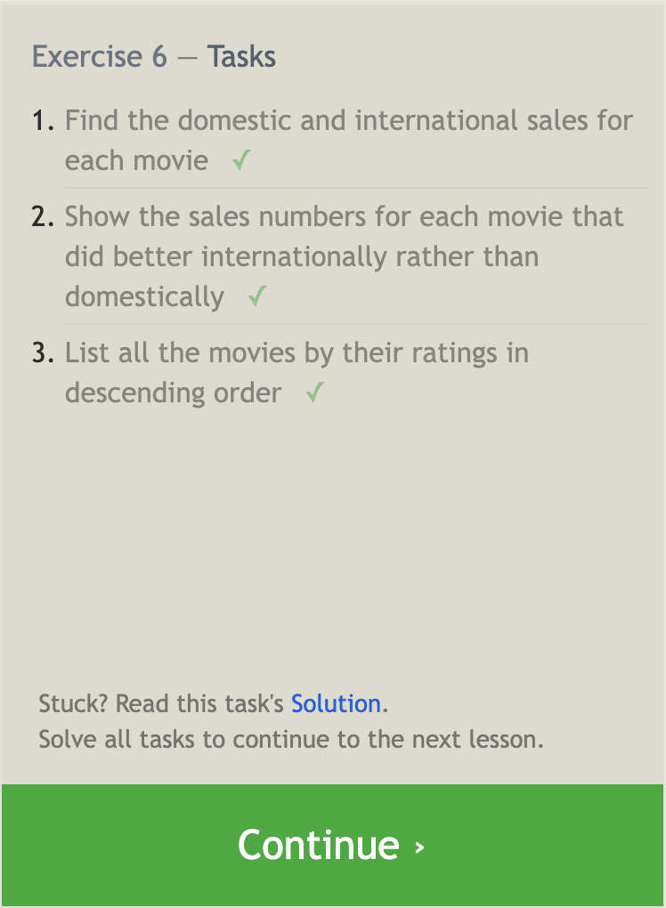
- Lessons 13 through 18 - Database Management
    - 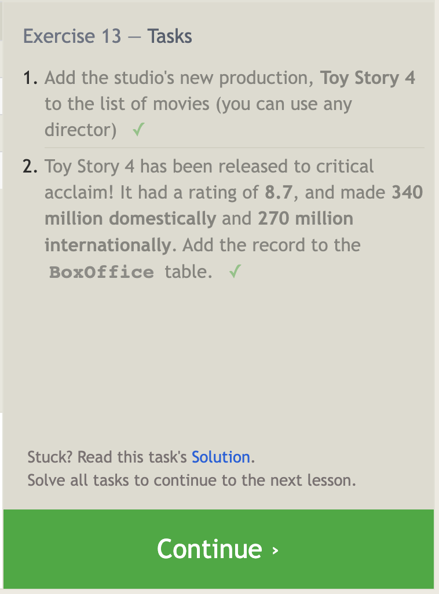
    - 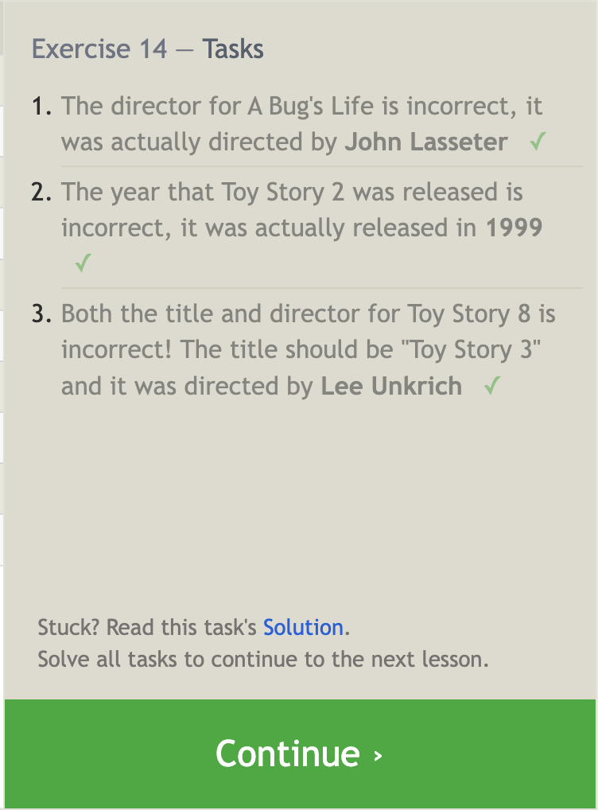
    - 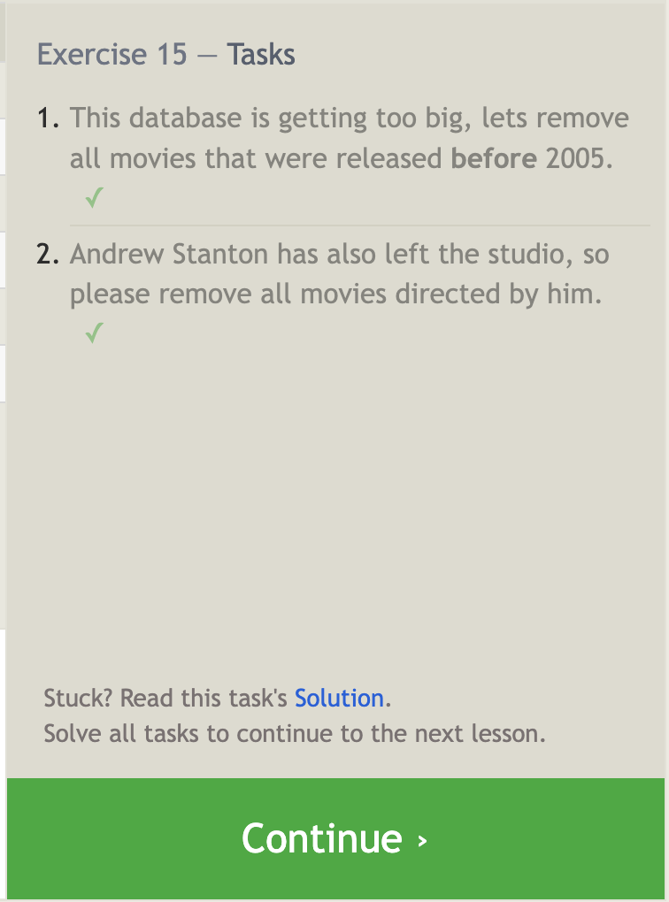
    - 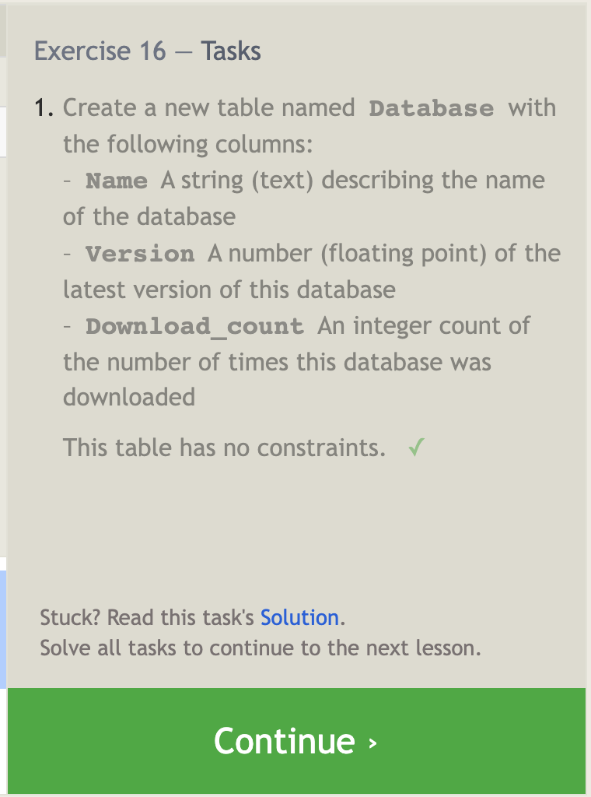
    - 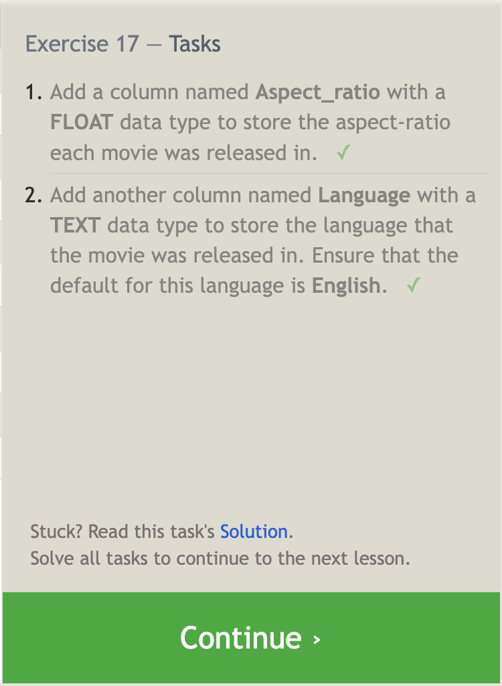
    - 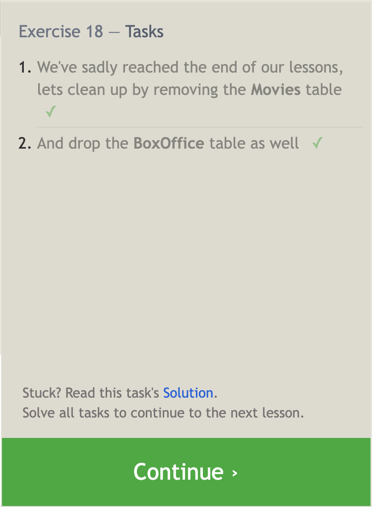


***

### Summarizing your understanding of relational databases and SQL: 

1. **What is SQL?**
   
   SQL (Structured Query Language) is a programming language used for managing and manipulating relational databases. It provides a standardized way to interact with databases and perform operations like querying, updating, and managing data.

2. **How is it used in software development?**
   
   SQL is commonly used in software development for tasks such as:
   
   - Retrieving data from databases
   - Storing and retrieving data for applications
   - Implementing data persistence in applications
   - Creating and modifying database schemas
   - Enforcing data integrity and constraints
   - Generating reports and analyzing data

3. **Select queries**
   
   Select queries retrieve data from a database table. Example:
   
   ```
   SELECT column1, column2
   FROM table_name;
   ```

4. **Queries with constraints**

    Queries with constraints allow you to filter data based on specific conditions. Example:

    ```
    SELECT column1, column2
    FROM table_name
    WHERE condition;
    ```

5. **Filtering and sorting query results**

    Filtering and sorting query results enable you to refine and order the retrieved data. Example:

    ```
    SELECT column1, column2
    FROM table_name
    WHERE condition
    ORDER BY column1 ASC;
    ```

6. **Simple select queries**

    Simple select queries retrieve all columns from a table. Example:

    ```
    SELECT *
    FROM table_name;
    ```

7. **Multi-table queries with JOINs**

    Multi-table queries with JOINs combine data from multiple tables using common columns. Example:

    ```
    SELECT column1, column2
    FROM table1
    JOIN table2 ON table1.column = table2.column;
    ```

8. **Inserting rows**

    Inserting rows allows you to add new records to a table. Example:

    ```
    INSERT INTO table_name (column1, column2)
    VALUES (value1, value2);
    ```

9. **Updating rows**

    Updating rows modifies existing records in a table. Example:

    ```
    UPDATE table_name
    SET column1 = value1
    WHERE condition;
    ```

10. **Deleting rows**

    Deleting rows removes specific records from a table. Example:

    ```
    DELETE FROM table_name
    WHERE condition;
    ```

11. **Creating tables**

    Creating tables defines a new table in the database. Example:

    ```
    CREATE TABLE table_name (
        column1 datatype,
        column2 datatype,
        ...
    );
    ```

12. **Altering tables**

    Altering tables allows you to modify the structure of an existing table. Example:

    ```
    ALTER TABLE table_name
    ADD column_name datatype;
    ```

13. **Dropping tables**

    Dropping tables deletes a table from the database. Example:

    ```
    DROP TABLE table_name;
    ```


***
